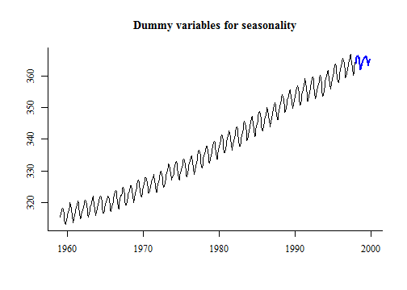
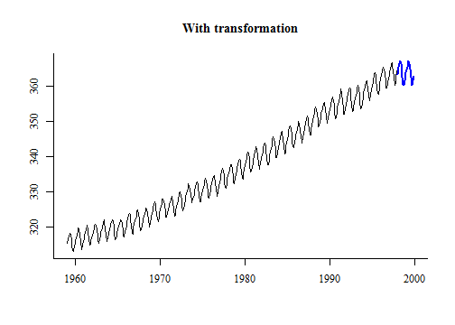
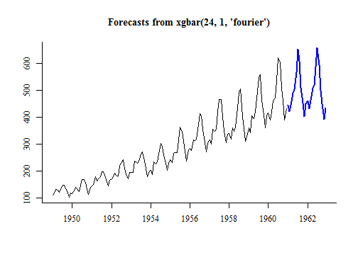

# forecastxgb-r-package
The `forecastxgb` package provides time series modelling and forecasting functions that combine the machine learning approach of Chen, He and Benesty's [`xgboost`](https://CRAN.R-project.org/package=xgboost) with the convenient handling of time series and familiar API of Rob Hyndman's [`forecast`](http://github.com/robjhyndman/forecast).  It applies to time series the Extreme Gradient Boosting proposed in [*Greedy Function Approximation: A Gradient Boosting Machine*, by Jermoe Friedman in 2001](http://www.jstor.org/stable/2699986). xgboost has become an important machine learning algorithm; nicely explained in [this accessible documentation](http://xgboost.readthedocs.io/en/latest/model.html).

[](https://travis-ci.org/ellisp/forecastxgb-r-package)
[](http://www.r-pkg.org/pkg/forecastxgb)
[](http://www.r-pkg.org/pkg/forecastxgb)

**Warning: this package is under active development and is some way off a CRAN release (realistically, no some time in 2017).  Currently the forecasting results with the default settings are, frankly, pretty rubbish, but there is hope I can get better settings.  The API and default values of arguments should be expected to continue to change.**

## Installation
Only on GitHub, but plan for a CRAN release in November 2016.  Comments and suggestions welcomed.

This implementation uses as explanatory features: 

* lagged values of the response variable
* numeric time,
* dummy variables for seasons.
* current and lagged values of any external regressors supplied as `xreg`


```r
devtools::install_github("ellisp/forecastxgb-r-package/pkg")
```

## Usage


## Basic usage

The workhorse function is `xgbar`.  This fits a model to a time series.  Under the hood, it creates a matrix of explanatory variables based on lagged versions of the response time series, dummy variables for seasons, and numeric time.  That matrix is then fed as the feature set for `xgboost` to do its stuff.

### Univariate

Usage with default values is straightforward.  Here it is fit to Australian monthly gas production 1956-1995, an example dataset provided in `forecast`:

```r
library(forecastxgb)
model <- xgbar(gas)
```

```
Stopping. Best iteration: 39
```
(Note: the "Stopping. Best iteration..." to the screen is produced by `xgboost::xgb.cv`, which uses `cat()` rather than `message()` to print information on its processing.)

By default, `xgbar` uses row-wise cross-validation to determine the best number of rounds of iterations for the boosting algorithm without overfitting.  A final model is then fit on the full available dataset.  The relative importance of the various features in the model can be inspected by `importance_xgb()` or, more conveniently, the `summary` method for objects of class `xgbar`.


```r
summary(model)
```

```

Importance of features in the xgboost model:
     Feature         Gain        Cover   Frequence
 1:    lag24 4.771009e-01 0.0782463031 0.040650407
 2:     lag1 3.206121e-01 0.1047365989 0.199767712
 3:    lag12 1.893496e-01 0.0863216266 0.061556330
 4:     time 8.961361e-03 0.0556261553 0.029036005
 5:    lag23 8.954508e-04 0.0466612754 0.031358885
 6:    lag11 8.701390e-04 0.0282116451 0.036004646
 7:    lag10 2.571064e-04 0.0356053604 0.036004646
 8:    lag15 2.564976e-04 0.0450439002 0.027874564
 9:     lag8 1.973647e-04 0.0213609057 0.030197445
10:    lag22 1.260238e-04 0.0467190388 0.029036005
11:    lag20 1.169542e-04 0.0213378004 0.012775842
12:    lag21 1.142894e-04 0.0198937153 0.018583043
13:    lag19 1.092936e-04 0.0213724584 0.020905923
14:    lag16 1.028674e-04 0.0583294824 0.034843206
15:     lag5 9.872862e-05 0.0350392791 0.052264808
16:     lag2 9.722143e-05 0.0354667283 0.067363531
17:    lag13 9.525919e-05 0.0178257856 0.022067364
18:    lag14 8.384108e-05 0.0216728281 0.026713124
19:     lag9 8.356965e-05 0.0370725508 0.039488966
20:     lag3 8.296392e-05 0.0224468577 0.046457607
21:    lag18 6.682167e-05 0.0204829020 0.015098722
22:     lag7 6.245830e-05 0.0195702403 0.027874564
23: season10 5.828477e-05 0.0202634011 0.006968641
24:     lag4 4.316536e-05 0.0280268022 0.034843206
25:     lag6 4.307472e-05 0.0164279113 0.022067364
26:    lag17 2.683291e-05 0.0156423290 0.010452962
27:  season4 2.178538e-05 0.0029459335 0.001161440
28:  season8 1.689185e-05 0.0181839187 0.005807201
29:  season5 1.296806e-05 0.0014556377 0.001161440
30: season12 1.201612e-05 0.0007162662 0.001161440
31:  season6 9.631610e-06 0.0082832717 0.003484321
32:  season7 6.574207e-06 0.0001963956 0.001161440
33:  season9 4.525862e-06 0.0002657116 0.002322880
34: season11 3.151149e-06 0.0034311460 0.001161440
35:  season3 3.630195e-07 0.0051178373 0.002322880
     Feature         Gain        Cover   Frequence

 36 features considered.
476 original observations.
452 effective observations after creating lagged features.
```
We see in the case of the gas data that the most important feature in explaining gas production is the production 12 months previously; and then other features decrease in importance from there but still have an impact.

Forecasting is the main purpose of this package, and a `forecast` method is supplied.  The resulting objects are of class `forecast` and familiar generic functions work with them.


```r
fc <- forecast(model, h = 12)
plot(fc)
```


Note that prediction intervals are not currently available.

See the vignette for more extended examples.

### With external regressors
External regressors can be added by using the `xreg` argument familiar from other forecast functions like `auto.arima` and `nnetar`.  `xreg` can be a vector or `ts` object but is easiest to integrate into the analysis if it is a matrix (even a matrix with one column) with well-chosen column names; that way feature names persist meaningfully.  

The example below, with data taken from the `fpp` package supporting Athanasopoulos and Hyndman's [Forecasting Principles and Practice](https://www.otexts.org/fpp) book, shows income being used to explain consumption.  In the same way that the response variable `y` is expanded into lagged versions of itself, each column in `xreg` is expanded into lagged versions, which are then treated as individual features for `xgboost`.


```r
library(fpp)
consumption <- usconsumption[ ,1]
income <- matrix(usconsumption[ ,2], dimnames = list(NULL, "Income"))
consumption_model <- xgbar(y = consumption, xreg = income)
```

```
Stopping. Best iteration: 35
```

```r
summary(consumption_model)
```

```

Importance of features in the xgboost model:
        Feature         Gain        Cover   Frequence
 1:        lag1 2.661271e-01 0.0827531394 0.176969697
 2:        lag2 2.554177e-01 0.1028771261 0.099393939
 3: Income_lag0 1.118823e-01 0.0900015896 0.061818182
 4:        lag3 4.599884e-02 0.0466062629 0.069090909
 5:        lag8 4.232664e-02 0.1188682244 0.056969697
 6:        lag5 3.955193e-02 0.0320457797 0.042424242
 7:        time 3.932981e-02 0.0441901129 0.042424242
 8: Income_lag8 3.582390e-02 0.0608806231 0.052121212
 9:        lag6 3.332802e-02 0.0333492291 0.043636364
10:        lag7 2.280162e-02 0.0665712923 0.064242424
11: Income_lag1 2.108113e-02 0.0644412653 0.038787879
12: Income_lag5 1.674024e-02 0.0315371165 0.027878788
13:        lag4 1.635172e-02 0.0753139405 0.056969697
14: Income_lag6 1.596227e-02 0.0283897632 0.026666667
15: Income_lag2 1.212812e-02 0.0324908600 0.041212121
16: Income_lag3 1.031139e-02 0.0186933715 0.027878788
17: Income_lag7 7.396999e-03 0.0170084247 0.021818182
18: Income_lag4 6.643026e-03 0.0218407248 0.032727273
19:     season2 6.532480e-04 0.0018756954 0.003636364
20:     season3 1.431929e-04 0.0295024638 0.010909091
21:     season4 8.024994e-07 0.0007629948 0.002424242
        Feature         Gain        Cover   Frequence

 21 features considered.
164 original observations.
156 effective observations after creating lagged features.
```
We see that the two most important features explaining consumption are the two previous quarters' values of consumption; followed by the income in this quarter; and so on.


The challenge of using external regressors in a forecasting environment is that to forecast, you need values of the future external regressors.  One way this is sometimes done is by first forecasting the individual regressors.  In the example below we do this, making sure the data structure is the same as the original `xreg`.  When the new value of `xreg` is given to `forecast`, it forecasts forward the number of rows of the new `xreg`.  

```r
income_future <- matrix(forecast(xgbar(usconsumption[,2]), h = 10)$mean, 
                        dimnames = list(NULL, "Income"))
```

```
Stopping. Best iteration: 1
```

```r
plot(forecast(consumption_model, xreg = income_future))
```


## Options

### Seasonality

Currently there are two methods of treating seasonality.  The first method tried (and still the default, despite its poor performance - this may change) is to throw dummy variables for each season into the mix of features for `xgboost` to work with.  The alternative is to perform classic multiplicative seasonal adjustment on the series before feeding it to `xgboost`.   This seems to work better:


```
Stopping. Best iteration: 30
```

```
Stopping. Best iteration: 32
```

```
No h provided so forecasting forward 24 periods.
```



```
No h provided so forecasting forward 24 periods.
```


### Transformations

By default, the data is transformed by a modulus power transformation (as per John and Draper, 1980) before feeding to `xgboost`.  This transformation is similar to a Box-Cox transformation, but works with negative data.  The value of lambda is chosen by `forecass:BoxCox.lambda`, using the Guerrero method.  Setting the `lambda` parameter to 1 will effectively switch off this transformation

```
Stopping. Best iteration: 61
```

```
Stopping. Best iteration: 35
```

```
No h provided so forecasting forward 24 periods.
```


```
No h provided so forecasting forward 24 periods.
```



### Non-stationarity
From experiments so far, it seems the basic idea of `xgboost` struggles in this context with extrapolation into a new range of variables not in the training set.  This suggests better results might be obtained by transforming the series into a stationary one before modelling - a similar approach to that taken by `forecast::auto.arima`.  This option is available by `trend_method = "differencing"` and seems to perform well - certainly better than without - and it will probably be made a default setting once more experience is available.


```r
model <- xgbar(AirPassengers, trend_method = "differencing", seas_method = "fourier")
```

```
Stopping. Best iteration: 25
```

```r
plot(forecast(model, 24))
```




## Future developments
Future work might include: 

* additional automated time-dependent features (eg dummy variables for trading days, Easter, etc)
* ability to include xreg values that don't get lagged
* some kind of automated multiple variable forecasting, similar to a vector-autoregression.
* improved treatment of non-stationary series.  At the moment forecasts seem to level off, even though there is a visually obvious trend.  Obviously this could be fixed by differencing, but this would seem to be just reinventing auto.arima.
* Different treatments of seasonality.  At the moment there are two options (dummy variables, or de-seasonalising the series before analysis via classical multiplicative decomposition), but there should be at least two more: ignore seasonality altogether, and add some kind of cyclic time variable.
